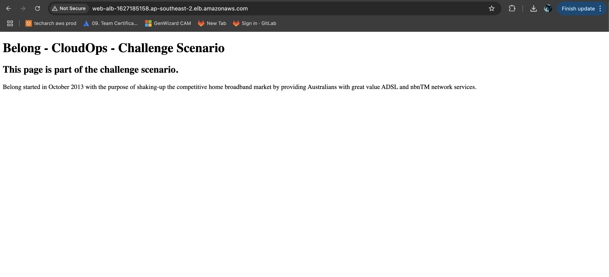

# 🛠️ Terraform Project

## 🔗 Reference
This project is based on the requirements outlined in the [📄 Belong Cloud Platforms Coding Challenge](Belong_Cloud_Platforms_Coding_Challenge.pdf).

Refer the above document for complete solution details.

## 🌟 Overview
This project is a Terraform configuration to 🏗️ provision resources in AWS. It includes reusable modules for better organization and follows best practices for 🛡️ maintainability and scalability.

## 🔒 State Management
- The Terraform state file is securely managed in an S3 bucket.
- DynamoDB is used for state locking to ensure consistency during concurrent operations.

## 📂 Structure
```
terraform_project/
├── backend.tf         # 📦 Backend configuration for storing state
├── main.tf            # 🗂️ Root module configuration
├── provider.tf        # 🌐 AWS provider configuration
├── variables.tf       # 🛠️ Variable definitions
├── output.tf          # 📤 Output definitions
├── terraform.tfvars   # ⚙️ Default values for variables
├── modules/           # 📦 Directory for reusable modules
│   ├── vpc/           # 🌐 VPC module
│   ├── ec2/           # 💻 EC2 module
│   └── alb/           # 📡 ALB module
├── screenshots/       # 📸 Directory for screenshots
```

## 🛠️ How to Use
1. 📥 Install [Terraform](https://www.terraform.io/downloads).
2. 🔧 Initialize the project:
   ```bash
   terraform init
   ```
3. 📋 Plan the resources to be created:
   ```bash
   terraform plan
   ```
4. 🚀 Apply the configuration to create resources:
   ```bash
   terraform apply
   ```

## ✅ Prerequisites
- 🛡️ AWS credentials configured locally (via `~/.aws/credentials` or environment variables).
- Ensure the required IAM permissions are available for the user or role running Terraform.

## 🔧 Variables
The variables used in this project are defined in `variables.tf`. Defaults can be overridden in `terraform.tfvars`. Key variables include:
- `aws_region`: 🌎 AWS region where resources are created.
- `vpc_cidr_block`: 🔢 CIDR block for the VPC.
- `instance_type`: 💻 EC2 instance type.
- `ami_id`: 📸 AMI ID for the EC2 instance.

## 📤 Outputs
Key outputs include:
- 🌐 ALB DNS name.
- 🛡️ Security group IDs.
- 💻 EC2 instance details.

## 📝 Notes
- Ensure that the backend configuration in `backend.tf` is correctly set for your environment.
- The `terraform.tfvars` file contains ⚙️ default variable values and should be updated as needed.

## 🔑 SSM Login for Developers
AWS Systems Manager (SSM) is configured for EC2 instances to allow developers to log in securely without needing SSH. Follow the steps below to use SSM:

### 🛠️ Prerequisites

1. Your AWS CLI must have the `ssm:StartSession` permission.
2. 📥 Install the [Session Manager Plugin](https://docs.aws.amazon.com/systems-manager/latest/userguide/session-manager-working-with-install-plugin.html) for the AWS CLI.

### 📋 Steps to Log In
1. Open a terminal and ensure your AWS CLI is configured:
   ```bash
   aws configure
   ```
2. List available managed instances:
   ```bash
   aws ssm describe-instance-information
   ```
   Look for the instance ID of the target EC2 instance.

3. Start a session:
   ```bash
   aws ssm start-session --target <INSTANCE_ID>
   ```
   Replace `<INSTANCE_ID>` with the actual instance ID of the EC2 instance.

4. Once logged in, you can run commands directly on the instance.

5. Exit the session:
   ```bash
   exit
   ```

### 🛠️ Troubleshooting
- If the instance does not appear in Systems Manager:
  - ✅ Verify the IAM role and attached policies.
  - 🟢 Ensure the SSM Agent is running:
    ```bash
    sudo systemctl status amazon-ssm-agent
    ```
  - 🧐 Check the SSM Agent logs for errors:
    ```bash
    sudo tail -f /var/log/amazon-ssm/amazon-ssm-agent.log
    ```

## 📸 Proof of Website Availability
To confirm the website is live and accessible, here’s a screenshot of the hosted page:



Because seeing is believing! 🎉 And who wouldn’t want visual confirmation of our hard work?
